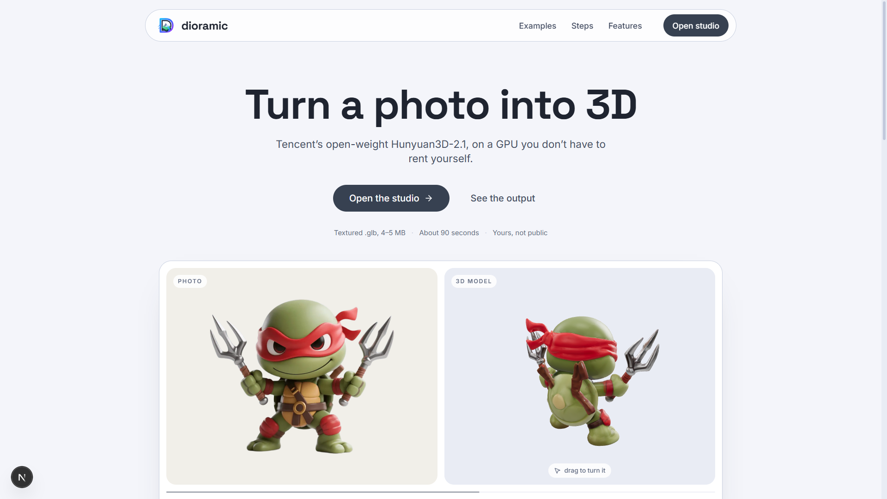
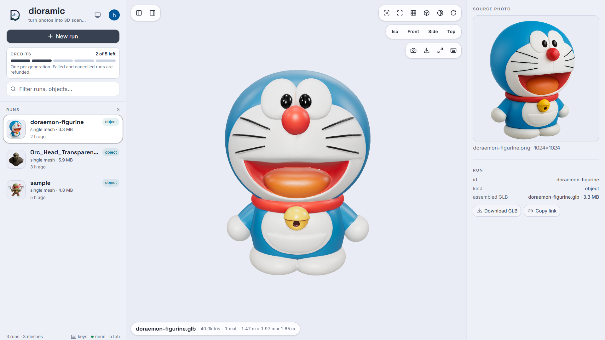
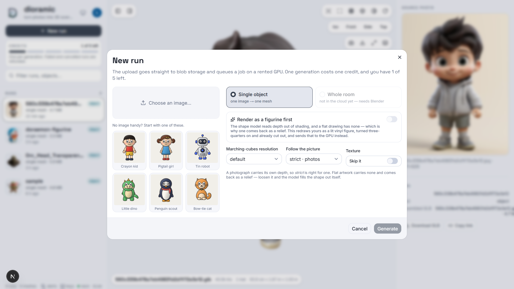

<div align="center">

# dioramic

**Turn a photo into 3D.** Upload a picture, a rented GPU turns it into a
textured mesh, and the result is yours — private to your account.

Next.js 16 · three.js · Clerk · Neon · Vercel Blob · Modal · Hunyuan3D-2.1

</div>



**Nothing is stored on the machine running the app.** Photos and meshes go to
blob storage under a per-user key; every run, job and placement lives in Neon
Postgres, keyed by Clerk user id. The app writes nothing to the repo —
no `inputs/`, no `outputs/`.

Deeper notes live in [docs/](docs/): [architecture](docs/architecture.md) ·
[status](docs/status.md) · [testing](docs/testing.md) ·
[decisions](docs/decisions.md) · [roadmap](docs/roadmap.md) ·
[model landscape](docs/models.md)

---

## Setup

The app needs four services, all free to start, plus one optional fifth.

| | what it holds | where |
|---|---|---|
| **Clerk** | who each row belongs to | [dashboard.clerk.com](https://dashboard.clerk.com) |
| **Neon** | runs, jobs, placements, credits | [console.neon.tech](https://console.neon.tech) |
| **Vercel Blob** | photos and meshes | Vercel dashboard → Storage |
| **Modal** | the GPU that generates | [modal.com](https://modal.com), $30/month free |
| **OpenAI** *(optional)* | the figurine pre-render — see [below](#flat-artwork-is-re-rendered-first) | [platform.openai.com](https://platform.openai.com) |

```powershell
cd frontend
npm install
Copy-Item .env.example .env           # then fill in the keys
npm run db:migrate                    # create the tables
npm run dev                           # http://localhost:3000
```

Then deploy the GPU worker and give the app its address:

```powershell
modal secret create dioramic-api-token DIORAMIC_TOKEN=<a long random string>
modal deploy scripts/modal_app/hunyuan3d.py
# put the printed `api` URL in MODAL_ENDPOINT, and the same random string
# in MODAL_TOKEN
```

Every variable is documented in [frontend/.env.example](frontend/.env.example).
Leave `OPENAI_API_KEY` unset and the figurine option is hidden rather than
shown broken — a run without it still works.

## What runs where

```
browser ──upload──> Next.js ──blob──> Vercel Blob      (photo, mesh bytes)
                       │
                       ├──row───> Neon Postgres        (runs, jobs, placement)
                       │
                       └──HTTP──> Modal, L40S/A100/H100
                                    rembg -> Hunyuan3D-Shape -> Hunyuan3D-Paint
                                    -> textured .glb, back as bytes
```

A generation takes 60–105 seconds on a warm container, so the app never holds
the request open: `POST /api/jobs` uploads the photo and asks Modal to *spawn*
the call, and the viewer's existing poll of `GET /api/jobs` is what collects
the finished mesh, stores it and writes the run. Nothing is held in process
memory in between, so a redeploy or a closed tab mid-generation loses nothing.

### One object, from one image — the only pipeline in the cloud

Hunyuan3D-2.1 on a rented GPU. Upload a photo of a single object, roughly
centred; background removal runs automatically. A textured mesh comes back at
~40 k triangles and 4–5 MB, a raw one at up to 1.5 M triangles and ~22 MB.
Flags, costs and troubleshooting: **[scripts/modal_app/README.md](scripts/modal_app/README.md)**.

### A whole room, from one photo — not in the cloud yet

```
detect  ->  reconstruct  ->  layout  ->  assemble
GroundingDINO   TripoSR      camera model    Blender
                per object   + size priors   -> one .glb
```

This is implemented, in [src/services/](src/services/), and it
works — but its last stage drives **Blender** as a subprocess, and none of it
has been packaged into a Modal container. The **Whole room** option is
therefore shown but disabled in the app. The code is kept as the source for
that port; see [docs/roadmap.md](docs/roadmap.md).

`scene.json` — the millimetre-rounded contract between the pipeline and
Blender, documented in [src/schemas/scene.py](src/schemas/scene.py)
— is now a `spec` column on the run rather than a file on disk.

---

## The app

`/` is the landing page — public, and built around three meshes the app
generated from its own sample images, turning beside the pictures they came
from. The app itself is at **`/app`**, behind sign-in.



**The viewer** is a Next.js + three.js inspector organised around **runs**.
A run is one row and the blobs it points at — the photo, the mesh, and for a
room the crops and placements too — presented as one thing:

```
sidebar          stage                       detail
────────┬───────────────────────────┬──────────────────────
runs    │  the mesh, in 3D          │  the photo it came
jobs    │                           │  from, boxes drawn on
        ├───────────────────────────┤  it
        │  pipeline strip:          │
        │  photo → crops → scene    │  the crop, the mesh
        │                           │  stats, the placement
```

Click any object in the strip — or any box drawn on the photo — and the whole
right-hand column becomes that one object's story: **which patch of the
photograph** produced it, **the crop** that was fed to the reconstructor, **the
mesh** that came back (triangles, materials, bounding box in metres), and
**where it was placed** (position, target size, rotation). That is the
end-to-end trace for a single result. The status bar under the viewport carries
the same numbers for whatever is selected, and **Download GLB** / **Copy link**
in the detail panel hand you the file itself.

Everything it shows comes from Neon, filtered to the signed-in user, and every
mesh and photo is fetched through `/api/files/<blob key>` — the one route that
can read a private blob, and only after checking the key belongs to the caller.
There is no unauthenticated view of anything.

### Credits

**Every account gets 5 free generations.** A GPU minute costs real money, so a
job costs one credit, taken when it is submitted and given back if the job
fails or is cancelled — nothing you cannot open is charged for. The sidebar
counts them down.

The balance is two integers on one row moved by a single conditional `UPDATE`;
Neon's HTTP driver has no interactive transaction, so `where spent < granted`
*inside* the update is the check, and two simultaneous submits cannot both pass
it. Details, and how to top an account up:
[frontend/README.md](frontend/README.md#credits).

### Run kinds

Runs come in four shapes, and the viewer labels which one it is looking at:

| kind | what it is |
|---|---|
| `object` | one image → one mesh. The only kind the cloud produces today |
| `room` | photo → crops → meshes → assembled scene |
| `scene` | a spec with its GLB — hand-written or re-assembled |
| `images` | crops with no spec, from a run that did not finish |

Things it deliberately surfaces rather than hides: objects that were **detected
and reconstructed but never placed** (a mesh under 200 faces is dropped — see
`is_usable`), and objects that **skipped reconstruction entirely** because they
are flat and became textured panels.

### Keys

| camera | | display | | navigation | |
|---|---|---|---|---|---|
| `F` | fit the selection, or the scene | `W` | wireframe | `↑` `↓` | step through the run's objects |
| `1` `2` `3` `4` | iso · front · side · top | `G` | ground grid | `click` | select part of a scene |
| `drag` | orbit | `B` | bounding box | `Esc` | clear the selection |
| `right-drag` | pan | `E` | flip the backdrop | `S` | save a PNG of the view |
| `scroll` | zoom toward the cursor | `R` | spin | `?` | this list |
| `double-click` | set the orbit pivot | | | | |

Drop a `.glb` from anywhere onto the viewport to inspect it without restarting.
New runs appear on their own — no refresh needed.

---

## Generating from the viewer

The page can start runs, not just look at them. **+ New run** — or dropping an
image onto the viewport — opens the form.



| control | |
|---|---|
| **Choose an image** | or one of six starter characters, so the app can be tried without hunting for a photo first |
| **Single object** / **Whole room** | the room pipeline is visible but disabled until it is ported |
| **Render as a figurine first** | one image-model call that gives flat artwork the shading the GPU needs — [below](#flat-artwork-is-re-rendered-first) |
| **Marching-cubes resolution** | `default`, or 128 · fast → 256 · fine |
| **Follow the picture** | `strict · photos`, `balanced`, `loose · flat art` — [below](#follow-the-picture) |
| **Texture** | skip the paint pass for a raw, much larger mesh |

The upload goes to blob storage under `u/<userId>/<slug>/`, a job row is
written, and the bytes are handed to Modal. The job card shows the stage and a
**Stop** button; when the mesh comes back it is stored, the run is written, and
the viewer opens it.

Jobs no longer queue. The one-at-a-time rule existed because two concurrent
TripoSR runs OOM a 4 GB card; Modal allocates a container per call, so that
constraint is gone.

Uploads are capped at 40 MB and must carry an image extension. Blob keys are
derived from the Clerk user id, so a key is checked for ownership by its prefix
before a single byte is read back.

### Follow the picture

Upstream's guidance scale of 5.0 is tuned for photographs, where every shadow
is a depth cue worth obeying. **A flat drawing has none**, so obeying it
literally returns a relief — a cel-shaded cat came back 20 mm deep against
1.5 m wide. Loosening the setting lets the model's own 3D prior fill the figure
out: the same drawing at 2.0 measured 2.3× deeper. A figurine render inverts
that again — it *has* shading, so strict is right for it, which is the hint the
form shows once one is in hand.

### Flat artwork is re-rendered first

Hunyuan3D infers volume from shading, and a cel-shaded drawing offers none:
every surface is one flat fill, so it returns a relief and the black outlines
come back as creases in the mesh. **Render as a figurine first** re-renders the
upload as a lit vinyl figure before the GPU ever sees it, which happens to fix
three separate things in one call:

- **shading** — the gradients and ambient occlusion are synthesised rather than
  inferred from an image that never had any
- **pose** — the prompt asks for a three-quarter view, and a frontal
  orthographic drawing is the worst possible case for monocular reconstruction
- **cutout** — a transparent background means the Modal side skips `rembg`
  entirely, and rembg's u2net is a photo segmenter that chews on exactly what
  cartoon art is made of: white-on-white socks, pencil-thin limbs, pale outlines

What it does not fix: one image is still one image, so the back is still
invented downstream. And this rewrites the character rather than photographing
it — the likeness drifts, differently every call. Which is why **nothing here
is automatic**: the render comes back to the browser and becomes the job's
input only if you look at it and accept it. A bad one costs a retry rather than
a credit and two minutes of L40S. Capped at 20 renders per user per day.

Needs `OPENAI_API_KEY`; without it the toggle is hidden. Implementation, and
the reasoning behind every clause of the prompt:
[frontend/src/lib/stylize.ts](frontend/src/lib/stylize.ts).

### Where the boxes on the photo come from

Runs record each detection — its pixel box, its label and the detector's
confidence — into `scene.json` under `source`. Runs made before that recording
existed have none, and the viewer falls back to the `.provenance.json` sidecar
if one was cached for them; the caption says which of the two you are looking
at.

Setup, environment variables and the catalog schema:
**[frontend/README.md](frontend/README.md)**.

Other options for viewing a `.glb`: drag it onto
[gltf-viewer.donmccurdy.com](https://gltf-viewer.donmccurdy.com), the **glTF
Tools** VS Code extension, Windows **3D Viewer**, or Blender via
`File → Import → glTF 2.0`.

---

## How the room pipeline decides where things go

A single photo has no depth, so two assumptions supply it.

**Furniture has known real-world sizes.** [`SIZE_PRIORS`](src/services/layout_service.py) says a double bed is about 2.0 × 1.6 m. Without that, every mesh would stay in the unit cube it was generated in — an image-to-3D model has no idea whether it made a lamp or a wardrobe.

**Depth comes from apparent height.** An object of known height spanning *h* pixels sits at `focal × real_height / h`. Height is used rather than the bottom edge of the detection box for two reasons: projected height does not change as an object turns, and it survives occlusion of the base. In the sample bedroom the wardrobe stands behind the bed, so its box bottom is where the duvet begins — treating that as a floor contact put it 13 m away.

**The assumed field of view sets the scale of everything.** Interior renders use wide lenses. Measured on the sample bedroom, 62° (a normal photographic default) put the wardrobe at 6.9 m and produced a 9 × 10 m "bedroom"; 85° puts it at 4.5 m. If a room comes out too large, raise `--fov`.

Walls are generated, never reconstructed: a room is a handful of boxes, and generating them gives exact right angles, flat faces, correct normals and a couple of kilobytes, where reconstruction gives wavy holed geometry and megabytes.

**Only two walls are built by default.** A closed box is correct and also useless — a viewer orbiting outside it sees six blank faces and nothing of the room. `--walls auto` keeps the far wall plus whichever side wall actually holds artwork, so pictures have somewhere to hang. `--walls all` closes the box, `--walls none` gives furniture only, or name them explicitly: `--walls "-x,+y"`.

**Flat things are built as textured quads, not reconstructed.** Ask an image-to-3D model for a painting and it returns a volumetric blob; uniform-fitting that blob into a 5 cm-deep target collapses the whole thing, which is how a 0.9 m painting once came out 6 cm across. A quad cut from the source crop is more faithful, weighs two triangles instead of twenty thousand, and skips reconstruction entirely. Applies to paintings, curtains, windows and mirrors — see `flat` in `SIZE_PRIORS`.

Reconstruction sometimes fails silently rather than erroring: a wide, shallow crop can come back as a near-empty shell. Meshes under 200 faces are dropped and reported, because such an object still claims a place in the room while its degenerate bounding box makes placement arbitrary.

**Fitting allows a bounded amount of stretch.** A strictly uniform fit is bound by whichever axis reaches its target first, which is punishing when the mesh has the wrong proportions — and reconstructed furniture usually does. A nearly-cubic wardrobe blob came out 0.89 × 0.60 × 0.75 m against a 1.20 × 0.60 × 2.30 m target, because its depth pinned every other axis. `--max-stretch` (default 1.5) lets the other axes scale up to 1.5× the tightest one, never past their own target, capping distortion at 1.5:1 instead of leaving everything shrunk. `--max-stretch 1.0` restores the strictly uniform fit.

Known limits: object yaw is not estimated, side-wall items are centred along their wall since one view gives no depth cue there, and a badly mis-proportioned mesh still falls short of its target once it hits the stretch cap. The output is a plausible editable starting layout, not a measurement.

## Input images matter more than settings

`dioramic-generate` is a **single-object** reconstructor — a whole-room photo produces garbage. Crop to one object, roughly centred, filling most of the frame. Background removal runs automatically (`rembg`).

`dioramic-room` does that cropping for you, which is the entire point of the detect step.

## Four things this project works around

**No CUDA Toolkit.** TripoSR depends on `torchmcubes`, a CUDA extension compiled from source that needs `nvcc` — the driver's CUDA runtime is not enough. [compat.py](src/services/backends/compat.py) satisfies the import with **PyMCubes**, which ships prebuilt wheels. torchmcubes is a GPU port of PyMCubes with the same signature and conventions, so it is a drop-in replacement. Marching cubes runs on CPU, which costs almost nothing next to the transformer forward pass and keeps the density grid off a 4 GB card.

**4 GB VRAM.** `CHUNK_SIZE` defaults to 4096 rather than upstream's 8192 (~6 GB). On a CUDA OOM the runner halves the chunk size and retries automatically, down to 512, rather than crashing.

**Inverted meshes.** TripoSR emits **inside-out** meshes. [isosurface.py:50](vendor/TripoSR/tsr/models/isosurface.py#L50) does `v_pos[..., [2, 1, 0]]`, swapping X and Z; swapping two axes is a reflection, which reverses triangle orientation. Verified here — signed volume was `-0.064` before the fix and `+0.064` after. `FLIP_FACES=true` is therefore the default.

**Meshes arrive in arbitrary orientations.** Nothing in a GLB says which way is up, and reconstruction does not produce a canonical one — `chair.glb` here comes out 1.07 × 0.60 × 0.57 m, lying on its side. Since the spec states real dimensions, those imply an orientation, so the assembler tries all six axis permutations and keeps whichever fills the target box best. Reflections are excluded, or asymmetric furniture would come out mirrored.

## Two Pythons

Blender bundles its own interpreter (3.13 here) which cannot see this venv (3.10), and never will. The pipeline therefore splits, joined by a file:

```
src/services (venv) --writes--> scene.json --read by--> Blender (bpy)
```

Everything upstream of that JSON is testable without Blender; everything downstream is testable without a GPU. [schemas/scene.py](src/schemas/scene.py) defines the format — metres, Z up, floor at z=0 — and is the contract between them. Nothing under `src/services/blender/` may import from `src/` or any third-party package.

## Moving to a bigger GPU

`MODEL_BACKEND=hunyuan3d` is implemented in [backends/hunyuan3d.py](src/services/backends/hunyuan3d.py) and produces substantially better output, but **cannot run here**: ~6 GB for geometry, ~16 GB with texture, plus two CUDA extensions that need the Toolkit. The backend refuses to load below 6 GB.

### Modal: rent the GPU per second, keep working here

[scripts/modal_app/](scripts/modal_app/) is a ready-to-run [Modal](https://modal.com) app for **Hunyuan3D-2.1** — the newer model, with PBR texture output. It builds the CUDA image, compiles both extensions, and caches ~30 GB of weights in a Volume, all on Modal's side. This machine sends an image and receives a `.glb`:

```powershell
uv pip install -e ".[modal]"
modal setup                                        # one-time browser login
modal run scripts/modal_app/hunyuan3d.py::prefetch         # warm the weight cache (optional)
modal run scripts/modal_app/hunyuan3d.py --image photos\chair.png
```

That `modal run` path writes a `.glb` next to you and is for one-off command-line
use; the app itself never uses it, going through the deployed `api` endpoint
instead. The first build takes 20–40 min (cached afterwards); a warm container
turns an image into a textured mesh in 3–6 minutes for roughly 10–20 cents. A new
Modal account gets $30 of free credit a month. Setup, flags, costs and
troubleshooting: **[scripts/modal_app/README.md](scripts/modal_app/README.md)**.

No HuggingFace account is needed: `tencent/Hunyuan3D-2.1` is public and the container downloads it anonymously. `HF_TOKEN` in `.env` is forwarded if present, but only raises the download rate limit.

### Or a plain rented box

On a rented GPU (RunPod/Vast, ~$0.30–0.50/hr for a 4090), with the 2.0 backend in `src/`:

```bash
git clone <this project> && cd 3d
uv venv --python 3.10 && source .venv/bin/activate
uv pip install torch torchvision --index-url https://download.pytorch.org/whl/cu124
uv pip install -r requirements.txt && uv pip install -e . --no-deps
cd vendor/Hunyuan3D-2/hy3dgen/texgen/custom_rasterizer      && python setup.py install
cd ../differentiable_renderer                               && python setup.py install
MODEL_BACKEND=hunyuan3d dioramic-room --image photos/bedroom.jpg --jobs 4
```

`--jobs` is only useful there. Each worker loads its own copy of the model, so parallel reconstruction needs roughly 10 GB before it beats the sequential path — which loads the weights once and reuses them.

## Layout

```
pyproject.toml          package metadata, console scripts
requirements.txt        deps for the backend and the pipeline
.env.example            tunables and API settings, documented

src/                    the backend. Layered top to bottom: a request enters
                        at routes/ and only ever moves down.
  main.py               the FastAPI app - uvicorn src.main:app
  config.py             .env -> Config, CLI override, device and Blender resolution
  routes/               HTTP only: paths, status codes, the token dependency
    dependencies.py     get_config() and the X-Dioramic-Token check
    health.py           /health, /health/doctor
    generate.py         /generate, /result, /cancel  (one object, via Modal)
    rooms.py            /rooms                       (one photo -> one scene)
    scenes.py           /scenes/assemble             (scene.json -> one GLB)
  controllers/          one per route: validate, orchestrate, shape the reply
  services/             the work, with no HTTP in it
    modal_service.py    queue and collect on the Modal GPU worker
    generation_service.py   local backend loop, with OOM backoff
    diagnostics_service.py  the environment checks --doctor prints
    preprocess_service.py   rembg cutout, square padding
    segmentation_service.py GroundingDINO detection + cropping
    layout_service.py       camera model, size priors, placement
    room_service.py         the four-stage room orchestrator
    assembly_service.py     drives Blender as a subprocess
    backends/           image -> mesh, one file per model
      base.py           Backend ABC + registry + vendor cloning
      triposr.py        runs on 4 GB
      hunyuan3d.py      cloud GPU only
      compat.py         torchmcubes -> PyMCubes shim
    blender/
      build_scene.py    runs INSIDE Blender: walls, import, fit, export
  schemas/              what crosses those lines
    scene.py            the SceneSpec JSON contract, shared with Blender
    generation.py       /generate request and responses
    room.py             /rooms and /scenes/assemble bodies
  cli/                  the same services from a terminal, one file per command
    generate.py         dioramic-generate  (one image -> one mesh)
    room.py             dioramic-room      (one photo -> one scene)
    assemble.py         dioramic-assemble  (scene.json -> one GLB)

frontend/               the app itself: Next.js + three.js, Clerk, Neon,
                        blob storage, Modal (own README)
  src/app/(public)/     the landing page
  src/app/(auth)/       Clerk sign-in and sign-up
  src/app/(protected)/  /app - the studio, and its components
  src/lib/              jobs, credits, storage, stylize, runs, modal
  drizzle/              migrations for the Neon schema

images/                 the screenshots in this README

scripts/                selftest.py (venv) and verify_scene.py (Blender)
  modal_app/            Hunyuan3D-2.1 on a rented Modal GPU
    hunyuan3d.py        image, weight volume, entrypoint
    call.py             send an image from here, receive a .glb
    README.md           setup, flags, costs, troubleshooting

docs/                   architecture, status, testing, decisions, roadmap, models
notebooks/              Colab harness comparing TripoSR / Hunyuan3D / TRELLIS

vendor/                 upstream repos, cloned on first run (gitignored)
```

`vendor/` exists because these projects ship as repositories, not installable packages — there is no `setup.py` to pip-install. The first run clones TripoSR there automatically.
